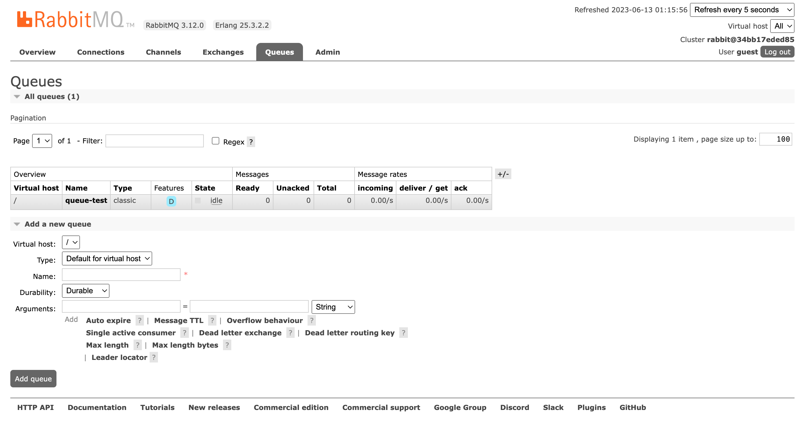

### NodeJS com RabbitMQ

> Para instalar o RabbitMQ

```console
sudo docker run -d -it --name rabbitmq -p 5672:5672 -p 15672:15672 rabbitmq:3.12-management
```

> Para rodar o projeto

```console
yarn start
```

> Dashboard do RabbitMQ (http://localhost:15672/#/queues)

